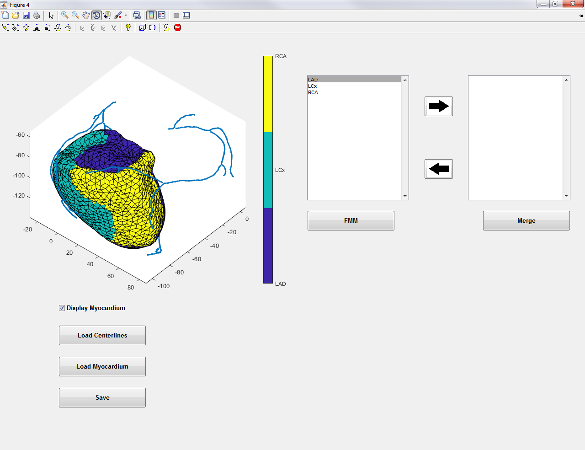
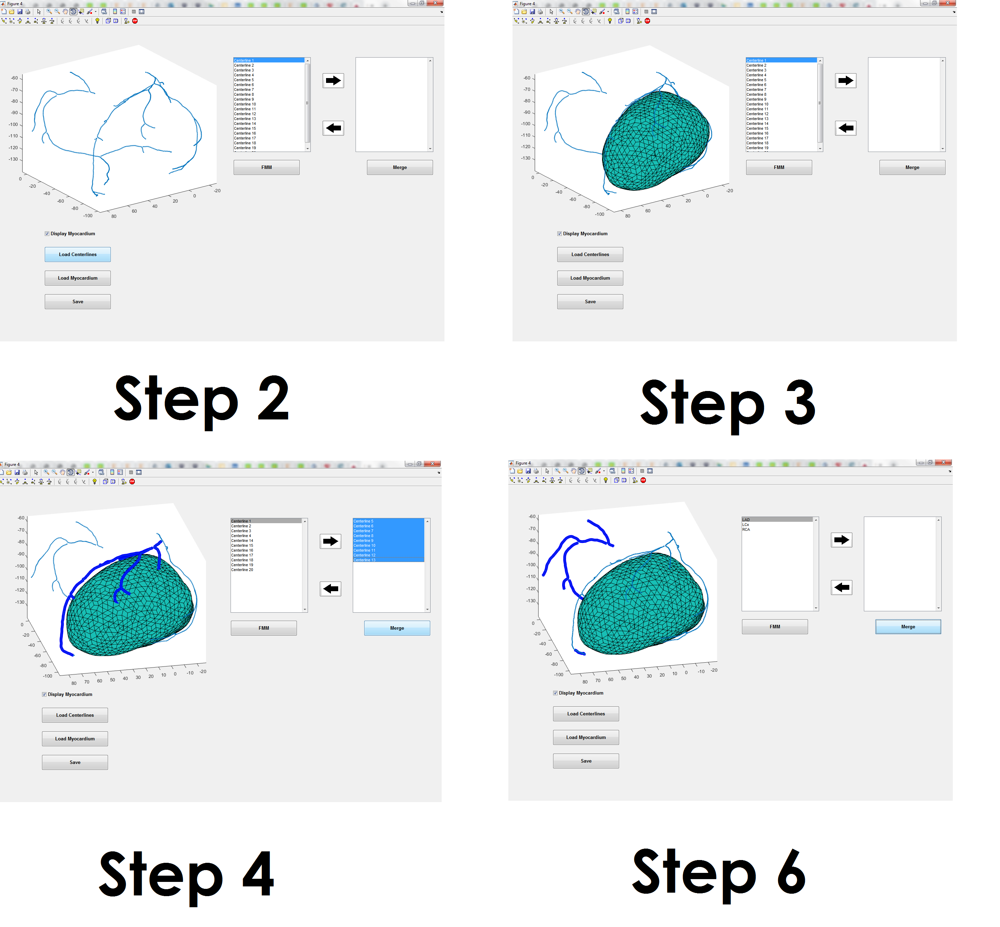

# Fractional Myocardial Mass
## Overview
This repository contains MATLAB code to determine the 
fractional myocardial mass. Example centerlines and myocardium are provided
in the examples folder. After the myocardium has been associated with each
vessel the vessel-specific myocardium volume are displayed. The vessel-specific 
volumes can finally be saved as a .txt file.

## Usage
1. From the MATLAB command window run *FMM_GUI.m*. 
2. Press the *Load Centerlines* button to read vessel centerlines.
This should be done for both left and right coronaries.
3. Press the *Load Myocardium* button and read the myocardium file.
4. To merge centerline segments into a larger centerline e.g. LAD
select the centerlines and move to the next panel. Press the *Merge* button.
5. Repeat until all centerlines have been merged. 
6. Press the *FMM* button and wait for the to complete.

## Input File Formats
### Centerlines File
This must be a **.vtp ascii** file. This must be generated by VMTK. 
Please use the generate_centerlines.py file in the utilities 
folder for the correct method to generate this file.

### Myocardium file
This must be a **.vtu ascii** file. This is a tetrahedral mesh of the myocardium.
This file can be generated by VMTK or other programs that support the .vtu format. 
If you have a .stl file of the myocardium surface use the 
generate_mesh.py file in the utilities folder to create the .vtu mesh file.

## Requirements
MATLAB (tested with R2018b)
VMTK

## Acknowledgements
This repository uses [dijkstra.m](https://www.mathworks.com/matlabcentral/fileexchange/12850-dijkstra-s-shortest-path-algorithm) from Joseph Kirk in order to find the
shortest path along the mesh. 
